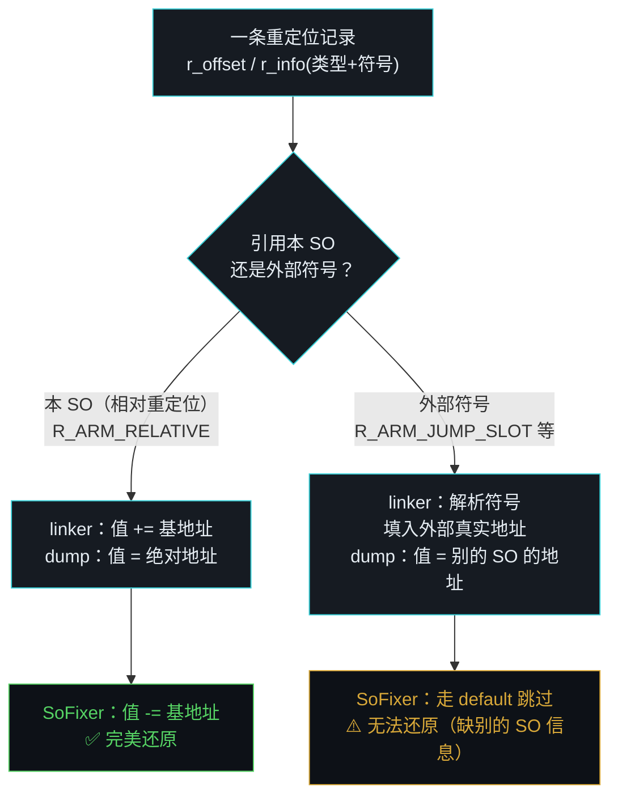

# 重定位原理

> 重定位是 SoFixer 最难讲清、也最容易出错的部分。这一页面向**没学过链接器原理的读者**，把"为什么运行时代码要被改写"讲透。
>
> 建议先读 [前置背景知识](./background) 的"重定位"一节。

## 为什么需要重定位

写 C 代码时，你调用一个函数 `foo()`，或访问一个全局变量 `g_count`。编译成机器码后，CPU 执行那条指令时，需要知道 `foo` / `g_count` 的**确切内存地址**才能跳过去/访问到。

问题来了：

- **同一个 SO 里**的符号：编译时不知道这个 SO 会被加载到哪个基址（ASLR 地址随机化），所以编译器只能写"相对偏移"。
- **跨 SO 的符号**（比如你调 libc 的 `printf`）：编译时更不知道 `printf` 在哪，它在另一个 SO 里，要等运行时由 linker 找到。

**重定位**就是解决"地址还没定，先留个占位符，等地址知道了再填回去"的机制。编译器留占位符、登记一条"这里要填什么"的记录；linker 加载时按记录把真实地址填进去。

## 重定位表长什么样

重定位表是一个数组，每条记录（`Elf_Rel` / `Elf_Rela`）说三件事：

```
┌──────────────────────────────────────────────────┐
│ r_offset  → 要改写的位置（虚拟地址）              │
│ r_info    → 重定位类型 + 引用的符号索引            │
│ r_addend  → 额外加数（仅 RELA 有）                │
└──────────────────────────────────────────────────┘
```

举例一条："在地址 `0x1234` 处，按 `R_ARM_RELATIVE` 方式，加上基地址。"

linker 加载时读到这条，就去 `0x1234` 那个内存位置，把当前的值改一改。

## 两类重定位：相对 vs 需要符号

理解 SoFixer 行为的关键——重定位分两大类：



### 1. 相对重定位（`R_ARM_RELATIVE` / `R_386_RELATIVE`）

含义："这个位置里已经有一个**相对偏移**，加载时给它**加上基地址**，变成绝对地址。"

```
磁盘 SO：      该位置 = 相对偏移 0x1000
linker 加载：  该位置 = 0x1000 + 基地址 0x7db078b000 = 0x7db078c000  （绝对地址）
```

这是最常见的类型——SO 内部引用自己代码/数据的位置都用它。SoFixer 修复就是反过来：

```
dump 出来：    该位置 = 0x7db078c000  （绝对地址）
SoFixer 修复： 该位置 = 0x7db078c000 - 基地址 0x7db078b000 = 0x1000  （还原相对偏移）
```

源码里就是这一行：

```cpp
case R_ARM_RELATIVE:
case R_386_RELATIVE:
    *prel = *prel - dump_base;   // 绝对地址减去 dump 基地址
```

::: tip 为什么减基地址就行
相对重定位的语义是"加基地址"。linker 加载时加了，dump 时的值 = 原偏移 + 基地址。减回基地址，就回到原偏移。简单、对称、不需要符号信息——SoFixer 处理这类又快又准。
:::

### 2. 需要符号解析的重定位（`R_ARM_JUMP_SLOT` / `R_ARM_GLOB_DAT` 等）

含义："这个位置要填**某个符号的真实地址**，符号是谁看 `r_info` 的符号索引。"

比如调用 `printf`：重定位记录说"这里填 `printf` 的地址"。linker 加载时要在所有已加载 SO 里找到 `printf`，把地址填进来。这叫**动态符号解析**。

SoFixer 对这类**处理有限**——见下文"已知限制"。

## PLT 与 GOT：跨 SO 调用是怎么做的

跨 SO 调用（你调 `printf`）比想象的复杂，涉及两个表：

```
你的代码                PLT（过程链接表）          GOT（全局偏移表）
┌──────────┐           ┌──────────────┐          ┌──────────────┐
│ call printf│ ────────▶│ jmp [GOT[n]] │ ────────▶│ printf 真实地址│
└──────────┘           └──────────────┘          └──────────────┘
                        ↑ 一开始指向 linker 的    ↑ linker 解析后
                          解析 stub                填入真实地址
```

- **PLT（Procedure Linkage Table）**：一段跳板代码。你调 `printf` 时，实际跳到 PLT 里的一项，PLT 再从 GOT 拿地址跳过去。
- **GOT（Global Offset Table）**：一个地址表。每项对应一个外部符号，存它的真实地址。

**第一次调用**时，GOT 里还没有真实地址，PLT 会跳到 linker 的解析 stub，linker 找到 `printf`、把地址写进 GOT，再跳过去。之后调用直接走 GOT，不再解析（这叫**延迟绑定** lazy binding）。

延迟绑定的两次调用对比：

```mermaid
sequenceDiagram
    participant Code as 你的代码
    participant PLT as PLT 跳板
    participant GOT as GOT 表项
    participant Linker as linker
    participant Printf as printf (libc)

    Note over GOT: 初始：GOT[n] 指向 PLT 解析 stub
    rect rgb(22,27,34)
        Note over Code,Printf: 第一次调用 printf（触发解析）
        Code->>PLT: call printf
        PLT->>GOT: jmp [GOT[n]]
        GOT->>Linker: (指向 stub) 转交解析
        Linker->>Linker: 在已加载 SO 中查找 printf
        Linker->>GOT: 写入 printf 真实地址
        Linker->>Printf: 跳过去执行
    end
    rect rgb(13,17,23)
        Note over Code,Printf: 后续调用（直接走 GOT）
        Code->>PLT: call printf
        PLT->>GOT: jmp [GOT[n]]
        GOT->>Printf: (已是真实地址) 直接跳
    end
```




### 为什么这和 SoFixer 有关

dump 出来的 SO，GOT 里**已经被填了运行时的真实地址**。这些地址属于：
- 同一进程内别的 SO（外部符号的真实位置）。
- 或者就是本 SO 内的符号（相对重定位，已加基地址）。

SoFixer 能修的是后者（相对重定位，减基地址即可）；前者是**别的 SO 的绝对地址**，SoFixer 无法还原——因为它不知道那些符号本来该映射到本 SO 的哪里（源码注释说"I don't known other so info"）。

## SoFixer 实际处理哪些类型

看 `ElfRebuilder::relocate()` 的 switch：

| 类型 | 处理方式 | 说明 |
|---|---|---|
| `R_386_RELATIVE` / `R_ARM_RELATIVE` | `*prel -= dump_base` | 相对重定位，减基地址。**主要修复对象** |
| `0x402`（AARCH64 特殊） | 用符号表的 `st_value`，或分派到外部指针区 | 带符号的处理，依赖 symtab |
| `0x403`（RELA addend） | `*prel = rela->r_addend` | 直接用 addend |
| 其他（如 `R_ARM_JUMP_SLOT`） | **走 default，不处理** | 跳过，保持运行时值 |

::: warning 大部分跨 SO 调用不会被修复
`R_ARM_JUMP_SLOT`（PLT 跳板项）这类走 default 分支被跳过。所以修复后，GOT 里那些指向外部 SO 的地址**保持绝对地址**。这不影响 IDA 分析本 SO 的代码逻辑（函数体、控制流），但交叉引用到外部符号的部分不会还原。
:::

## REL vs RELA

两种重定位表格式：

| | `Elf_Rel` | `Elf_Rela` |
|---|---|---|
| 有无 addend | 无（addend 隐式在被改写的位置里） | 有（`r_addend` 显式给出） |
| 常见平台 | 32 位 ARM（`DT_REL`） | 64 位 AARCH64（`DT_RELA`） |
| SoFixer 处理 | `relocate<false>` | `relocate<true>` |

`isRela` 是模板参数，编译期由 `__SO64__` 决定走哪个分支。

## 为什么 `--membase` 是重定位的开关

重定位修复依赖 `dump_base`（你传的 `--membase`）：

- `dump_base != 0` → 正常修复相对重定位。
- `dump_base == 0` → `RebuildRelocs` **直接 return**，跳过整个重定位修复阶段。

```cpp
bool ElfRebuilder::RebuildRelocs() {
    if(elf_reader_->dump_so_base_ == 0) return true;  // 没基地址，直接跳过
    ...
}
```

所以不给 `--membase`，SO 的**结构**（section 表等）照样能修出来，但重定位项保持运行时的绝对地址。详见 [工作原理 · RebuildRelocs](./how-it-works#阶段四-rebuildrelocs-修复重定位)。

## 小结

- 重定位 = "地址没定先留占位符，运行时填回"。
- 相对重定位（`R_*_RELATIVE`）：加/减基地址，SoFixer 能完美还原。
- 需符号解析的（`R_ARM_JUMP_SLOT` 等）：依赖别的 SO 信息，SoFixer 基本跳过。
- `--membase` 控制"修不修重定位"，不是"修得好不好"。

继续阅读 [工作原理](./how-it-works) 看这些如何串进整体流程，或看 [ELF 字段速查](./elf-reference) 查具体字段。
